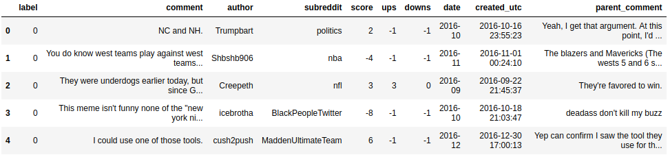
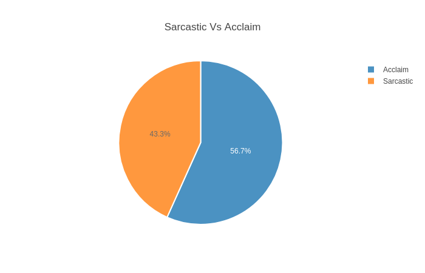
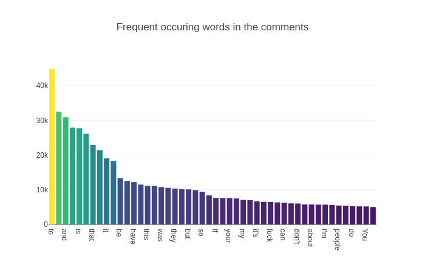
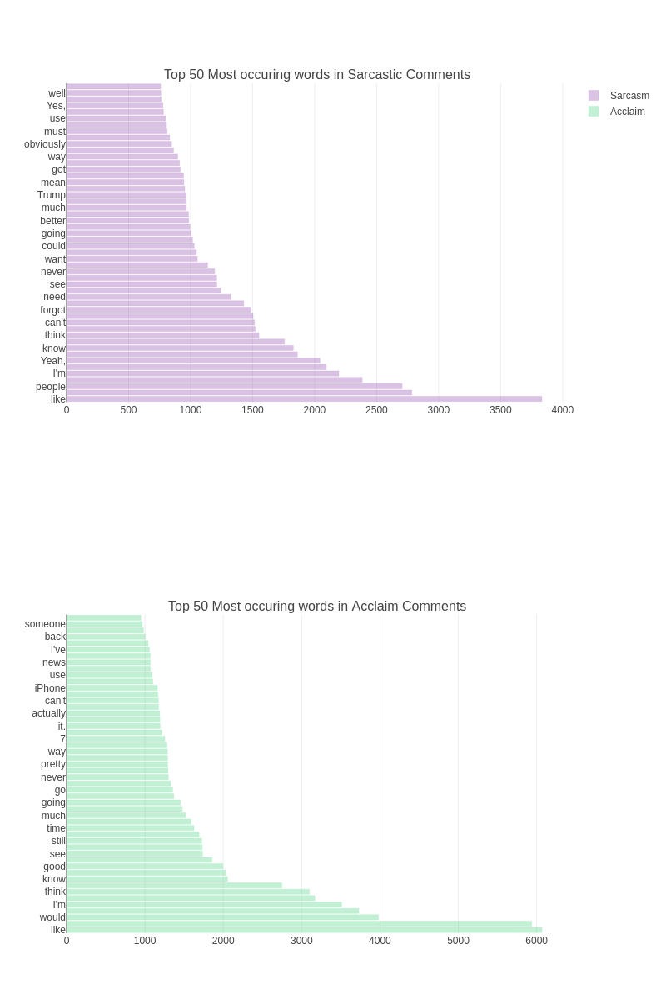
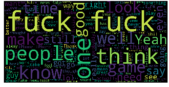
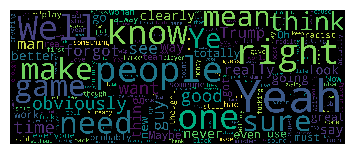
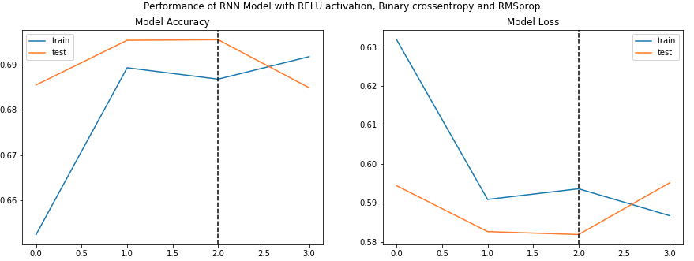
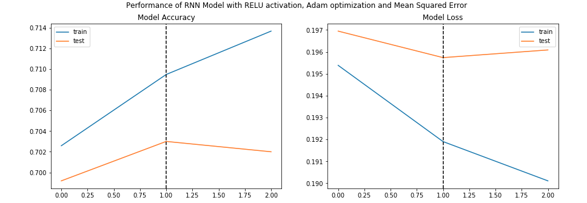
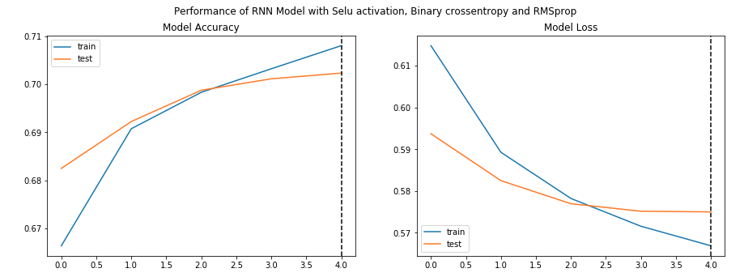

# RedditSarcasmDetector
This repository contains a python notebook, that is able to process and predict whether a reddit comment is sarcastic or not.
The used dataset can be found on https://www.kaggle.com/danofer/sarcasm, which contains around 1.3 million comments. Due to size constrictions the used dataset will be around 1/5.

Sample dataset:

Summary statistics of the Dataset:

As seen in the above image the used is not perfectly balanced, because only a part of the whole dataset has been used.

Uncleaned set of most occuring words:

The raw data must be cleaned to fullfil the needs of this project. Therefore Tokenization will be used and after that all stop words will be deleted.

Top occuring words divided by acclaimed and sarcastic after cleaning:

Moreover Stemming and Lemmatisation will be used on the raw data.

WordClouds of acclaimed and sarcastic comments in the same order after the above mentioned operations.

The next steps are part of the model building using keras.
1. Input and output vectors will be created and the lables will be preprocessed.

2. Data will be split into training and test.

3. Processing the data for the model
Data will be tokenized and the text converted to sequences.
Paddign will be added to ensure that all the sequences have the same shape.

4. Defining the RNN structure for the model

5. Compiling the model

6. Model will be fitted into the testing data and tested.

